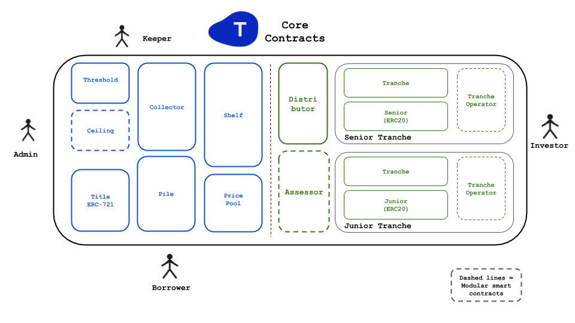

# Tinlake Contracts
Tinlake is a set of smart contracts that allows companies and individuals to use tokenized non-fungible real-world assets as collateral to obtain liquidity. 

 

## Install Dependencies
```bash 
dapp update
```

## Run Tests
```bash
dapp test
```
