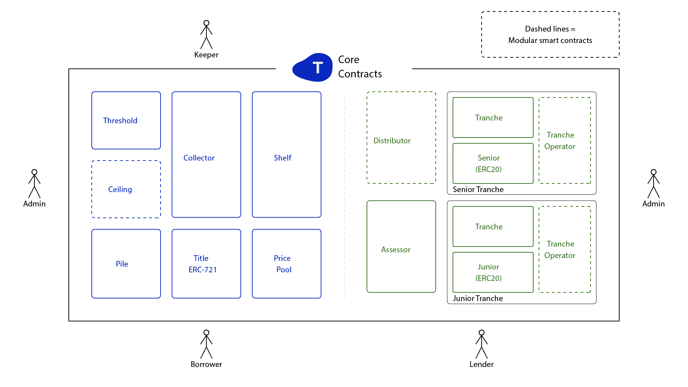

# Tinlake Contracts
Open Source implementation of the Tinlake in Solidity.  This repository contains the core contracts of Tinlake.

Tinlake is a set of smart contracts that allows companies and individuals to use tokenized non-fungible real-world assets as collateral to obtain liquidity. 

 


## Documentation
For learning more about Tinlake visit [Tinlake Documentation](https://developer.centrifuge.io/tinlake/overview/introduction/)

## Install
Tinlake uses [dapp.tools](https://github.com/dapphub/dapptools) for development. Please install the `dapp` client. 

### Install Dependencies
```bash 
dapp update
```

## Run Tests
The tests for Tinlake are written in Solidity.
### Run all tests
```bash
dapp test
```
### Run a specific tests
A regular expression can be used to only run specific tests.
```bash
dapp test -r <REGEX> 
```
## Community
Join our public slack channel.

[Centrifuge Slack](http://centrifuge.io/slack)
